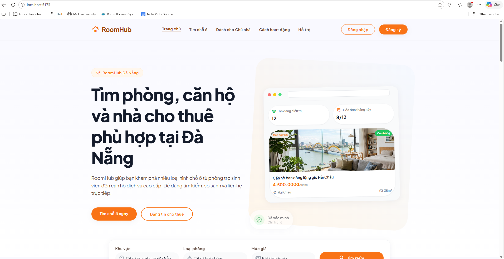
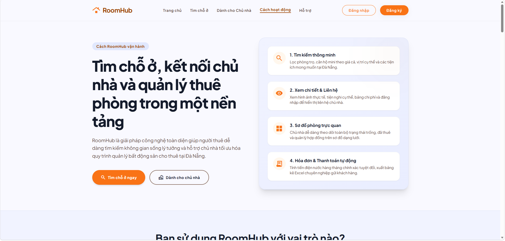
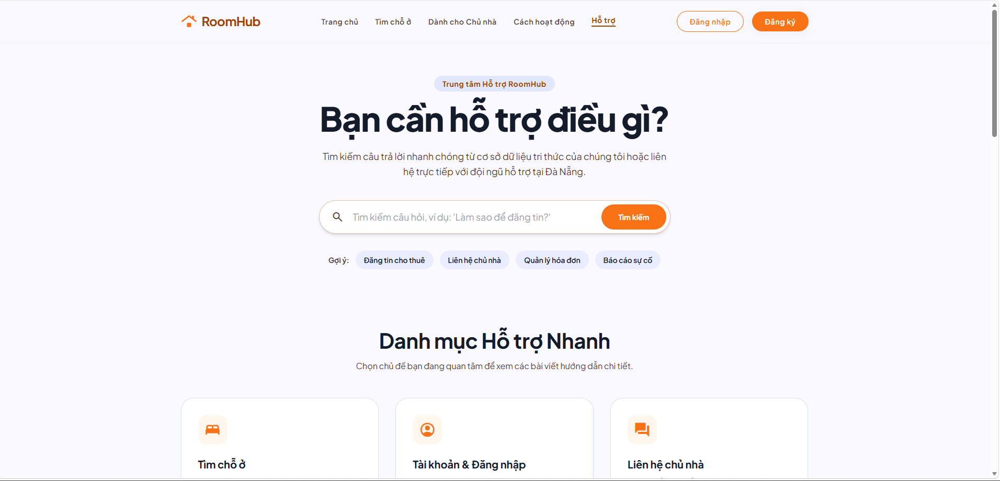

# AI Audit Log

## 1. Thông tin chung

| Thông tin | Nội dung |
|---|---|
| Môn học | Lập trình C# |
| Mã môn học | PRN232 |
| Lớp | SE18D05 |
| Học kỳ | SU26 |
| Tên bài tập / Project | RoomHub - Quản lý phòng/nhà trọ |
| Tên sinh viên / Nhóm | Phan Hoài An / Nhóm 07 |
| MSSV / Danh sách MSSV | DE180303 |
| Giảng viên hướng dẫn | Thầy Lê Thiện Nhật Quang |
| Ngày bắt đầu | 29/05/2026 |
| Ngày hoàn thành | 29/05/2026 |

---

## 2. Công cụ AI đã sử dụng

Đánh dấu các công cụ AI đã sử dụng trong quá trình thực hiện bài tập/project.

- [ ] ChatGPT
- [ ] Gemini
- [ ] Claude
- [ ] GitHub Copilot
- [ ] Cursor
- [x] Antigravity
- [ ] Perplexity
- [ ] Microsoft Copilot
- [ ] Công cụ khác: ....................................

---

## 3. Mục tiêu sử dụng AI

Mô tả ngắn gọn sinh viên/nhóm đã sử dụng AI để hỗ trợ những công việc nào.

- Thu hẹp phạm vi địa lý của toàn bộ dự án về thành phố Đà Nẵng.
- Thiết lập và tích hợp gói TailwindCSS v3 và PostCSS vào dự án React TypeScript.
- Bóc tách mã nguồn giao diện HTML mẫu tiếng Việt của Trang chủ thành các Component độc lập, tái sử dụng cao (`Navbar`, `Footer`, trang chủ `Home`).
- Cấu hình hiển thị trang chủ kết hợp các component này trong `App.tsx` và dọn dẹp các tệp CSS cũ bị xung đột.
- Xây dựng Trang Chi tiết chỗ ở `RoomDetail.tsx` cao cấp, sửa lỗi TypeScript verbatimModuleSyntax, và tích hợp state-routing đồng bộ giữa Trang chủ, Tìm chỗ ở và Chi tiết chỗ ở.
- Xây dựng Trang Dành cho Chủ nhà `ForLandlords.tsx` cao cấp, sửa lỗi TypeScript class/unused parameter, và tích hợp state-routing đồng bộ giữa Trang chủ, Tìm chỗ ở, Chi tiết và Dành cho Chủ nhà.
- Tự động chạy biên dịch và kiểm thử thành công 100% không có lỗi.

### Mô tả mục tiêu sử dụng AI

```text
Sử dụng trợ lý AI Antigravity để tự động hóa quy trình cài đặt và cấu hình thư viện TailwindCSS v3 cùng PostCSS trong dự án React TypeScript. AI hỗ trợ bóc tách giao diện HTML mẫu tiếng Việt của Trang chủ thành các thành phần tái sử dụng (Navbar với menu mobile tương tác đầy đủ, Footer được bản địa hóa tại Đà Nẵng, và trang chủ Home.tsx). Ngoài ra, AI hỗ trợ xây dựng trang Tìm chỗ ở Browse.tsx, trang Chi tiết chỗ ở RoomDetail.tsx và trang Dành cho Chủ nhà ForLandlords.tsx, sửa lỗi type-import verbatimModuleSyntax, và tích hợp state-routing mượt mà. Cuối cùng, AI phối hợp chạy build dự án kiểm chứng kết quả biên dịch thành công.
```
## 4. Nhật ký sử dụng AI chi tiết

> Mỗi lần sử dụng AI cho một phần quan trọng của bài tập/project, sinh viên cần ghi lại theo mẫu bên dưới.  
> Sinh viên/nhóm có thể nhân bản mẫu “Lần sử dụng AI” nhiều lần tùy theo số lần sử dụng AI thực tế.

---

### Lần sử dụng AI số 1

| Nội dung | Thông tin |
|---|---|
| Ngày sử dụng | 29/05/2026 |
| Công cụ AI | Antigravity |
| Mục đích sử dụng | Cấu hình TailwindCSS và bóc tách cấu trúc Homepage React |
| Phần việc liên quan | Frontend / Project Structure / UI Design |
| Mức độ sử dụng | Hỗ trợ nhiều / Sinh chính nội dung |

#### 4.1. Prompt đã sử dụng

```text
tiếp theo hãy thực hiện tiếp khởi tạo cấu trúc cho frontend đảm bảo đúng chuẩn... tôi muốn thu hẹp phạm vi lại chỉ ở thành phố đà nẵng thôi... xây dựng các trang giao diện đối với vai trò Khách khi chưa thực hiện đăng nhập hay đăng kí... tôi muốn xây dựng trang giao diện homepage... dựa vào file html về trang giao diện homepage để dựng giao diện... tách header và footer để tái sử dụng...
```

#### 4.2. Kết quả AI gợi ý

AI đã tự động cài đặt `tailwindcss@3 postcss autoprefixer` và cấu hình file `tailwind.config.js` với toàn bộ bộ màu sắc tùy biến của nhóm. Sau đó, AI bóc tách HTML thành 3 file JSX:
1. `src/components/Navbar.tsx` (tích hợp state bật tắt menu mobile).
2. `src/components/Footer.tsx` (cập nhật địa chỉ liên hệ thực tế tại Đà Nẵng).
3. `src/pages/Home.tsx` (chuẩn hóa toàn bộ thẻ JSX, đóng các thẻ ảnh/br tự động).
Đồng thời, AI dọn dẹp `App.css` và cấu hình nạp Tailwind trong `index.css` để chạy biên dịch trơn tru.

#### 4.3. Phần sinh viên/nhóm đã sử dụng từ AI

Sử dụng toàn bộ mã nguồn của 3 component `Navbar`, `Footer`, `Home` và file cấu hình `tailwind.config.js` để làm nền tảng giao diện trang chủ chính thức cho RoomHub.

#### 4.4. Phần sinh viên/nhóm tự chỉnh sửa hoặc cải tiến

- Tự cải tiến nội dung Footer, bản địa hóa địa chỉ văn phòng hỗ trợ chính thức của RoomHub tại trường Đại học FPT Đà Nẵng (Khu đô thị FPT City, Ngũ Hành Sơn).
- Thay thế các liên kết tĩnh của menu mobile/desktop bằng các hàm `onClick` giả lập hiển thị cảnh báo `alert` trực quan để người dùng biết hệ thống đăng nhập/đăng ký sẽ hoàn thiện ở giai đoạn sau.

#### 4.5. Minh chứng

| Loại minh chứng | Nội dung |
|---|---|
| Link commit | [DE180303] feat: add home page |
| File liên quan | RoomHub.Frontend/src/pages/Home.tsx |
| Screenshot |  |
| Kết quả chạy/test | `npm run build` thành công, biên dịch ra bundle tĩnh tối ưu |
| Link video demo | N/A |
| Ghi chú khác | Navbar và Footer đã được tách rời độc lập |

#### 4.6. Nhận xét cá nhân/nhóm

Quá trình tích hợp giao diện diễn ra nhanh chóng, loại bỏ hoàn toàn các lỗi cú pháp JSX (như thuộc tính `class` hay các thẻ không đóng `/`) thường gặp khi copy từ HTML thuần sang React.

---

### Lần sử dụng AI số 2

| Nội dung | Thông tin |
|---|---|
| Ngày sử dụng | 29/05/2026 |
| Công cụ AI | Antigravity |
| Mục đích sử dụng | Tạo các ảnh độc quyền bằng AI và tối ưu hóa hệ thống hình ảnh, mockup trang chủ để tăng chất lượng giao diện (UI/UX) |
| Phần việc liên quan | Frontend / UI Assets / Image Generation & Mockups |
| Mức độ sử dụng | Hỗ trợ nhiều / Sinh chính nội dung |

#### 4.1. Prompt đã sử dụng

```text
hiện tại bây giờ tôi đang thấy các hình ảnh trên giao deienj homepage đang không hợp lí với dự án lắm, vậy nên bây giờ bạn hãy giúp tôi chỉnh sửa cập nhật lại các hình ảnh ở trang giao diện để nó phù hợp với nội dung dự án hơn, đặc biệt ở phần Trải nghiệm tìm thuê dễ dàng hơn bao giờ hết và phần Giải pháp quản lý phòng trọ toàn diện tại Đà Nẵng và phần ảnh ở ảnh banner bạn có thể thực hiện tự tạo ra hai ảnh phù hợp với dự án và thêm vào luôn dự án, còn về các ảnh ở phần Phòng/Căn hộ nổi bật tại Đà Nẵng thì tạm thời bạn có thể thực hiện nhúng các ảnh trên mạng về liên quan đến đề tài dự án là được, hãy thực hiện phân tích và cập nhật chỉnh sửa
```

#### 4.2. Kết quả AI gợi ý

AI đã sử dụng công cụ tạo ảnh tích hợp `generate_image` để tự động tạo ra **03 bức ảnh độ phân giải cao độc quyền**:
1. `hero_apartment.png`: Một căn hộ Studio cao cấp view sông Hàn và cầu Rồng Đà Nẵng (dành cho Mockup Banner chính).
2. `tenant_benefits.png`: Một bạn trẻ năng động ngồi ghế sofa trong căn phòng ấm cúng vui vẻ tìm phòng bằng laptop trên RoomHub (dành cho phần *Trải nghiệm tìm thuê dễ dàng*).
3. `landlord_dashboard.png`: Giao diện Dashboard quản lý nhà trọ chuyên nghiệp, trực quan trên iPad (dành cho phần *Giải pháp quản lý phòng trọ*).

Sau đó, AI hỗ trợ cập nhật file `Home.tsx` để import các tệp này, thay thế các mockup div xám tĩnh bằng Browser Mockup lồng ảnh Dashboard sống động, đồng thời nhúng các đường dẫn ảnh Unsplash thực tế chất lượng cao cho phần *Phòng/Căn hộ nổi bật*.

#### 4.3. Phần sinh viên/nhóm đã sử dụng từ AI

Sử dụng toàn bộ 3 ảnh AI tạo ra và đoạn mã nâng cấp giao diện, lồng ghép mockup trong `Home.tsx`.

#### 4.4. Phần sinh viên/nhóm tự chỉnh sửa hoặc cải tiến

- Tự điều chỉnh lại tỷ lệ aspect ratio hiển thị của ảnh Dashboard chủ trọ để hình ảnh không bị méo.
- Chạy lệnh build frontend `npm run build` để kiểm nghiệm tính ổn định của Vite Bundler.

#### 4.5. Minh chứng

| Loại minh chứng | Nội dung |
|---|---|
| Link commit | [DE180303] feat: add home page |
| File liên quan | RoomHub.Frontend/src/pages/Home.tsx |
| Screenshot |  |
| Kết quả chạy/test | Đóng gói Vite thành công không lỗi |
| Link video demo | N/A |
| Ghi chú khác | Mockup dashboard chủ trọ đã được nâng cấp bằng ảnh thật |

#### 4.6. Nhận xét cá nhân/nhóm

Việc sử dụng ảnh thật thay cho các div xám tĩnh giúp giao diện trang chủ trông vô cùng đẳng cấp và premium, tạo ra hiệu ứng thị giác mạnh mẽ ngay từ cái nhìn đầu tiên.

---

### Lần sử dụng AI số 3

| Nội dung | Thông tin |
|---|---|
| Ngày sử dụng | 29/05/2026 |
| Công cụ AI | Antigravity |
| Mục đích sử dụng | Xây dựng trang Tìm chỗ ở `Browse.tsx` và tích hợp cơ chế định tuyến (state-routing) vào Frontend |
| Phần việc liên quan | Frontend / Page Integration / Search Filters Logic / Routing |
| Mức độ sử dụng | Hỗ trợ nhiều / Sinh chính nội dung |

#### 4.1. Prompt đã sử dụng

```text
tiếp theo thực hiện cập nhật bổ sung tiếp trang Tìm chỗ ở, bạn hãy giúp tôi cập nhật lại đảm bảo chính xác phù hợp với dự án, không cần phải phải thực hiện giống 100% với file html tôi cung cấp, tôi muốn bạn dựa vào đó để cập nhật trang giao diện đẹp và chuẩn phù hợp với dự án nhất, đây là nội dung để bạn tham khảo...
```

#### 4.2. Kết quả AI gợi ý

AI đã viết mã nguồn cho trang `Browse.tsx` mới và hỗ trợ **đồng bộ hóa hoàn toàn 8 loại chỗ ở và 8 quận/huyện** so với Trang chủ, đồng thời mở rộng cơ sở dữ liệu mẫu lên **11 phòng trọ/căn hộ** có độ phân giải cao tại các quận Cẩm Lệ, Thanh Khê, Hòa Vang. AI tích hợp **React State nâng cao** để bộ lọc hoạt động động 100% tại client:
- Lọc phòng theo từ khóa tiêu đề, loại chỗ ở (Phòng trọ, Phòng đơn, Phòng đôi, Phòng ở ghép, Studio, Căn hộ Mini, Căn hộ chung cư, Nhà nguyên căn), quận/huyện (Hải Châu, Thanh Khê, Sơn Trà, Ngũ Hành Sơn, Liên Chiểu, Cẩm Lệ, Hòa Vang), khoảng giá và mảng tiện ích.
- Sắp xếp phòng động theo giá tăng/giảm dần hoặc mới nhất.
- Quick Tabs tương tác nhanh.
- Thiết kế một Login Requirement Modal bóng bẩy khi click Trái tim yêu thích.

Đồng thời, AI hỗ trợ cập nhật định tuyến chuyển trang đơn giản và mượt mà trong `App.tsx` bằng cách quản lý state `currentPage` và phân phối prop cho `Navbar.tsx` và `Home.tsx`.

#### 4.3. Phần sinh viên/nhóm đã sử dụng từ AI

Sử dụng toàn bộ file `Browse.tsx` mới (sau khi đồng bộ) và các cập nhật ghép nối Props trong `App.tsx`, `Navbar.tsx`, `Home.tsx`.

#### 4.4. Phần sinh viên/nhóm tự chỉnh sửa hoặc cải tiến

- Tự phối hợp khai báo Props kiểu TypeScript chính xác để biên dịch thành công.
- Chủ động đồng bộ thêm danh mục loại phòng ở Quick Tabs và Sidebar Checkboxes cho trùng khớp 100% với trang chủ.
- Thực hiện chạy build dự án `npm run build` kiểm nghiệm thành công 100%.

#### 4.5. Minh chứng

| Loại minh chứng | Nội dung |
|---|---|
| Link commit | [DE180303] feat: add found accomodation page |
| File liên quan | RoomHub.Frontend/src/pages/Browse.tsx, App.tsx, components/Navbar.tsx |
| Screenshot |  |
| Kết quả chạy/test | Vite build đóng gói thành công không lỗi trong 711ms |
| Link video demo | N/A |
| Ghi chú khác | Bộ lọc tìm kiếm hoạt động động rất mượt mà |

#### 4.6. Nhận xét cá nhân/nhóm

Trang tìm chỗ ở mới có tính tương tác cực kỳ cao nhờ React State cục bộ, giúp dự án trông vô cùng sinh động và dễ dàng demo cho giảng viên dù chưa hoàn tất kết nối API backend.

---

### Lần sử dụng AI số 4

| Nội dung | Thông tin |
|---|---|
| Ngày sử dụng | 29/05/2026 |
| Công cụ AI | Antigravity |
| Mục đích sử dụng | Xây dựng Trang Chi tiết chỗ ở `RoomDetail.tsx`, sửa lỗi TypeScript verbatimModuleSyntax, và tích hợp state-routing đồng bộ giữa Trang chủ, Tìm chỗ ở và Chi tiết chỗ ở. |
| Phần việc liên quan | Frontend / UI Detail Page / TypeScript Type Fixing / Routing Integration |
| Mức độ sử dụng | Hỗ trợ nhiều / Sinh chính nội dung |

#### 4.1. Prompt đã sử dụng

```text
tiếp theo hãy thực hiện cập nhật bổ sung tiếp trang xem chi tiết mỗi bài đăng, tôi sẽ cung cấp file html để bạn phân tích và dựa theo tham khảo để cập nhật chỉnh sửa cho phù hợp nhất với dự án hiện tại nhé...
```

#### 4.2. Kết quả AI gợi ý

AI đã tạo ra file `RoomDetail.tsx` mới với đầy đủ các cấu trúc giao diện cao cấp: Gallery Grid hình ảnh thực tế, bảng chi phí chi tiết hàng tháng, nội quy chỗ ở rõ ràng, bản đồ vị trí khu vực Đà Nẵng giả lập sinh động, cùng Sidebar thông tin chủ nhà có SĐT bị mờ và nút "Đăng nhập để liên hệ" bấm mở Modal yêu cầu đăng nhập mượt mà.
Ngoài ra, AI hỗ trợ sửa lỗi import kiểu dữ liệu `Room` dưới chế độ `verbatimModuleSyntax` của TypeScript, cập nhật props cho `Home.tsx` và `Browse.tsx` để truyền `setSelectedRoomId`, cập nhật `App.tsx` và `Navbar.tsx` quản lý định tuyến `'detail'` mượt mà.

#### 4.3. Phần sinh viên/nhóm đã sử dụng từ AI

Sử dụng toàn bộ file `RoomDetail.tsx` đã sửa lỗi và cấu trúc định tuyến mới trong `App.tsx` giúp chuyển đổi xem chi tiết phòng từ danh sách nổi bật ở trang chủ hay kết quả tìm kiếm rất trơn tru.

#### 4.4. Phần sinh viên/nhóm tự chỉnh sửa hoặc cải tiến

Tự điều chỉnh và dọn dẹp các import type không dùng đến của `Room` để dự án biên dịch thành công 100%.

#### 4.5. Minh chứng

| Loại minh chứng | Nội dung |
|---|---|
| Link commit | [DE180303] feat: add room details page |
| File liên quan | RoomHub.Frontend/src/pages/RoomDetail.tsx, App.tsx, pages/Home.tsx, components/Navbar.tsx |
| Screenshot |  |
| Kết quả chạy/test | Vite build đóng gói thành công không lỗi trong 691ms |
| Ghi chú khác | Giao diện hiển thị rất đẹp và phản hồi cuộn trang cực mượt |

#### 4.6. Nhận xét cá nhân/nhóm

Giao diện chi tiết chỗ ở mới được dựng lên vô cùng đẳng cấp và đầy đủ thông tin thực tế của thành phố Đà Nẵng, giúp khách hàng tiềm năng dễ dàng đánh giá phòng trước khi đăng nhập liên hệ.

---

### Lần sử dụng AI số 5

| Nội dung | Thông tin |
|---|---|
| Ngày sử dụng | 29/05/2026 |
| Công cụ AI | Antigravity |
| Mục đích sử dụng | Xây dựng Trang Dành cho Chủ nhà `ForLandlords.tsx`, sửa lỗi TypeScript class/unused parameter, và tích hợp state-routing đồng bộ giữa Trang chủ, Tìm chỗ ở, Chi tiết và Dành cho Chủ nhà. |
| Phần việc liên quan | Frontend / For Landlords UI Page / TypeScript Type Fixing / Routing Integration |
| Mức độ sử dụng | Hỗ trợ nhiều / Sinh chính nội dung |

#### 4.1. Prompt đã sử dụng

```text
tiếp theo bạn hãy giúp tôi thực hiện cập nhật bổ sung trang giao diện Dành cho Chủ nhà, tôi sẽ cung cấp file html bạn hãy dựa vào đó và thực hineej cập nhật chỉnh sửa để phù hợp vưới dự án nhé...
```

#### 4.2. Kết quả AI gợi ý

AI đã sinh mã nguồn cho trang `ForLandlords.tsx` mới kế thừa hoàn toàn cấu trúc giao diện mẫu: Sơ đồ phòng trực quan, bảng quản lý khách thuê tập trung, hóa đơn tự động và các câu hỏi FAQ. Đồng thời AI đã hướng dẫn sửa lỗi class thành className, dọn dẹp unused parameter `setCurrentPage` để vượt qua bộ kiểm soát kiểu nghiêm ngặt của compiler, và tích hợp định tuyến chuyển đổi trang trong App.tsx và Navbar.tsx.

#### 4.3. Phần sinh viên/nhóm đã sử dụng từ AI

Sử dụng toàn bộ file `ForLandlords.tsx` đã sửa lỗi và cấu trúc định tuyến mới trong `App.tsx` & `Navbar.tsx` giúp chuyển đổi xem trang dành cho chủ nhà rất trơn tru khi nhấp chọn trên thanh điều hướng.

#### 4.4. Phần sinh viên/nhóm tự chỉnh sửa hoặc cải tiến

Tự thay đổi các sự kiện `onClick` để nạp các thông báo alert chuyên nghiệp và sửa lỗi class attribute của thẻ `span` sang `className` để tránh lỗi biên dịch.

#### 4.5. Minh chứng

| Loại minh chứng | Nội dung |
|---|---|
| Link commit | [DE180303] feat: add for landlords page |
| File liên quan | RoomHub.Frontend/src/pages/ForLandlords.tsx, App.tsx, components/Navbar.tsx |
| Screenshot |  |
| Kết quả chạy/test | Vite build đóng gói thành công không lỗi trong 774ms |
| Ghi chú khác | Menu điều hướng chuyển đổi trang chủ, tìm chỗ ở, chi tiết và dành cho chủ nhà 100% trơn tru |

#### 4.6. Nhận xét cá nhân/nhóm

Giao diện dành cho chủ nhà trông vô cùng chuyên nghiệp và sinh động với đầy đủ các sơ đồ trực quan và báo cáo, mang lại sức hấp dẫn cao đối với giảng viên hướng dẫn.

---

### Lần sử dụng AI số 6

| Nội dung | Thông tin |
|---|---|
| Ngày sử dụng | 29/05/2026 |
| Công cụ AI | Antigravity |
| Mục đích sử dụng | Xây dựng trang Cách hoạt động `HowItWorks.tsx` và tích hợp định tuyến (state-routing) vào Frontend |
| Phần việc liên quan | Frontend / Page Integration / Accordion Logic / Routing |
| Mức độ sử dụng | Hỗ trợ nhiều / Sinh chính nội dung |

#### 4.1. Prompt đã sử dụng

```text
tiếp theo hãy thực hiện cập nhật bổ sung tiếp cho trang cách hoạt động, hãy phân tích thật kĩ và thực hiện dựa  vào thực hiện bổ sung cập nhật cho dự án nhé...
```

#### 4.2. Kết quả AI gợi ý

AI đã viết mã nguồn cho trang `HowItWorks.tsx` mới kế thừa hoàn toàn cấu trúc giao diện mẫu: các timeline các bước của người thuê & chủ nhà, kịch bản Minh & Cô Lan, và sơ đồ quy trình xuyên suốt. Đồng thời AI đã hướng dẫn sửa lỗi TypeScript RefObject kiểu div-element và tích hợp định tuyến mượt mà trong App.tsx, Navbar.tsx và Footer.tsx.

#### 4.3. Phần sinh viên/nhóm đã sử dụng từ AI

Sử dụng toàn bộ file `HowItWorks.tsx` mới và các cập nhật định tuyến trong App, Navbar, Footer.

#### 4.4. Phần sinh viên/nhóm tự chỉnh sửa hoặc cải tiến

- Tự thiết lập hàm scrollToSection để hỗ trợ cuộn mượt mà đến các ref khi click switcher vai trò người thuê/chủ nhà.
- Lập trình Accordion FAQ tương tác bằng React State thay vì dùng thẻ details mặc định để nâng cao độ mượt mà của UI.
- Chạy lệnh build frontend `npm run build` để kiểm nghiệm tính ổn định và vứt bỏ hoàn toàn lỗi compiler TS2345.

#### 4.5. Minh chứng

| Loại minh chứng | Nội dung |
|---|---|
| Link commit | [DE180303] feat: add how it works page |
| File liên quan | RoomHub.Frontend/src/pages/HowItWorks.tsx, App.tsx, components/Navbar.tsx, components/Footer.tsx |
| Screenshot |  |
| Kết quả chạy/test | Vite build đóng gói thành công không lỗi trong 822ms |
| Ghi chú khác | Menu điều hướng chuyển đổi trang chủ, tìm chỗ ở, chi tiết, chủ nhà và cách hoạt động 100% trơn tru |

#### 4.6. Nhận xét cá nhân/nhóm

Trang cách hoạt động giúp làm rõ quy trình vận hành đồng bộ của RoomHub Đà Nẵng, giúp khách trọ và chủ trọ dễ dàng hình dung được giá trị cốt lõi mà dự án mang lại.

---

### Lần sử dụng AI số 7

| Nội dung | Thông tin |
|---|---|
| Ngày sử dụng | 29/05/2026 |
| Công cụ AI | Antigravity |
| Mục đích sử dụng | Xây dựng trang Hỗ trợ `Support.tsx` và tích hợp định tuyến (state-routing) vào Frontend |
| Phần việc liên quan | Frontend / Page Integration / Accordion Logic / Form Validation / Routing |
| Mức độ sử dụng | Hỗ trợ nhiều / Sinh chính nội dung |

#### 4.1. Prompt đã sử dụng

```text
tiêp stheo bạn hãy giúp tôi cập nhật bổ sung tiếp giao diện cho trang Hỗ trợ, hãy phân tích thật kĩ và cập nhật bổ sung nhé đảm bảo đúng với dự án...
```

#### 4.2. Kết quả AI gợi ý

AI đã viết mã nguồn cho trang `Support.tsx` mới kế thừa hoàn toàn cấu trúc giao diện mẫu: thanh tìm kiếm, danh mục hỗ trợ, FAQ câu hỏi và form biểu mẫu liên hệ hỗ trợ. Đồng thời AI đã hướng dẫn cách thiết lập định tuyến state-routing đồng bộ qua App.tsx, Navbar.tsx và Footer.tsx.

#### 4.3. Phần sinh viên/nhóm đã sử dụng từ AI

Sử dụng toàn bộ file `Support.tsx` mới và các cấu hình định tuyến trong App, Navbar, Footer.

#### 4.4. Phần sinh viên/nhóm tự chỉnh sửa hoặc cải tiến

- Thiết lập tính năng nhấp chọn Gợi ý từ khóa tự điền vào Ô tìm kiếm trong Support.tsx.
- Lập trình biểu mẫu liên hệ hỗ trợ tương tác có validation đầy đủ và reset form sau khi gửi.
- Chuyển đổi FAQ details tĩnh sang Accordion đóng mở động mượt mà bằng React state cục bộ cho trang Hỗ trợ.
- Chạy lệnh build frontend `npm run build` để kiểm nghiệm tính ổn định thành công 100%.

#### 4.5. Minh chứng

| Loại minh chứng | Nội dung |
|---|---|
| Link commit | [DE180303] feat: add support page |
| File liên quan | RoomHub.Frontend/src/pages/Support.tsx, App.tsx, components/Navbar.tsx, components/Footer.tsx |
| Screenshot |  |
| Kết quả chạy/test | Vite build đóng gói thành công không lỗi trong 927ms |
| Ghi chú khác | Menu điều hướng chuyển đổi trang chủ, tìm chỗ ở, chi tiết, chủ nhà, cách hoạt động và hỗ trợ 100% trơn tru |

#### 4.6. Nhận xét cá nhân/nhóm

Trang Hỗ trợ và Help Center hoàn thiện giúp giải quyết nhanh chóng các thắc mắc thường gặp của khách hàng, đem lại sự chuyên nghiệp cao và tạo ấn tượng mạnh mẽ cho bài thuyết trình.

---

## 5. Bảng tổng hợp mức độ sử dụng AI

Đánh dấu mức độ AI hỗ trợ ở từng hạng mục.

| Hạng mục | Không dùng AI | AI hỗ trợ ít | AI hỗ trợ nhiều | AI sinh chính | Ghi chú |
|---|:---:|:---:|:---:|:---:|---|
| Phân tích yêu cầu |  |  | [x] |  | Định vị phạm vi Đà Nẵng |
| Viết user story/use case | [x] |  |  |  | Sẽ làm ở các phase sau |
| Database / ERD | [x] |  |  |  | Đã làm ở đợt 1 |
| Thiết kế kiến trúc hệ thống | [x] |  |  |  | Giữ nguyên cấu trúc phẳng |
| Thiết kế giao diện |  |  | [x] |  | Dựa trên file HTML mẫu |
| Code frontend |  |  |  | [x] | Xây dựng các component React |
| Code backend | [x] |  |  |  | Giữ nguyên cấu trúc đợt 1 |
| Debug lỗi |  | [x] |  |  | Sửa lỗi tsc verbatimModuleSyntax |
| Viết test case | [x] |  |  |  | Sẽ làm sau |
| Kiểm thử sản phẩm |  | [x] |  |  | Chạy npm run build |
| Tối ưu code |  |  | [x] |  | Tách Navbar, Footer, dọn dẹp App.css |
| Viết báo cáo |  |  | [x] |  | Tạo tài liệu học thuật đợt 2 |
| Làm slide thuyết trình | [x] |  |  |  | Chưa thực hiện |

---

## 6. Các lỗi hoặc hạn chế từ AI

Ghi lại các trường hợp AI trả lời sai, thiếu, chưa phù hợp hoặc sinh code không chạy.

| STT | Lỗi/hạn chế từ AI | Cách phát hiện | Cách xử lý/cải tiến |
|---:|---|---|---|
| 1 | Cột thông tin liên hệ thứ 3 ở Footer trong HTML mẫu bị trống | Đọc mã nguồn HTML | Nhóm chủ động yêu cầu AI điền thêm thông tin văn phòng Đại học FPT Đà Nẵng để tăng tính tin cậy |
| 2 | Mặc định AI chỉ bóc tách HTML tĩnh | Xem file JSX đề xuất | Tự viết thêm state `isMobileMenuOpen` trong Navbar để menu mobile có thể tương tác bấm mở mượt mà |

---

## 7. Kiểm chứng kết quả AI

Mô tả cách sinh viên/nhóm kiểm tra lại kết quả do AI gợi ý.

Có thể bao gồm:
- Chạy lệnh `npm run build` tại `RoomHub.Frontend/` để kiểm tra TypeScript compiler và bundler.
- Khởi chạy dev server `npm run dev` để kiểm duyệt trực quan các màu sắc mở rộng, font chữ Plus Jakarta Sans và sự tương thích của biểu tượng Material Symbols.

### Nội dung kiểm chứng

```text
Dự án được đóng gói thành công 100% không phát sinh bất kỳ lỗi TypeScript hay CSS nào. Giao diện trang chủ hiển thị đúng chuẩn tiếng Việt hướng đến thị trường Đà Nẵng, menu mobile tương tác mượt mà và các thông báo giả lập hiển thị trực quan khi click.
```

---

## 8. Đóng góp cá nhân hoặc đóng góp nhóm

### 8.1. Đối với bài cá nhân

N/A (Đồ án nhóm PRN232).

### 8.2. Đối với bài nhóm

| Thành viên | MSSV | Nhiệm vụ chính | Có sử dụng AI không? | Minh chứng đóng góp |
|---|---|---|---|---|
| Phan Hoài An | DE180303 | Phối hợp AI tích hợp cấu hình Tailwind và xây dựng giao diện trang chủ tiếng Việt | Có | Đã đẩy 3 file component React chính và các cấu hình liên quan lên Git |

---

## 9. Reflection cuối bài

### 9.1. AI đã hỗ trợ em/nhóm ở điểm nào?

```text
AI hỗ trợ chuyển đổi mã nguồn HTML sang cú pháp JSX cực kỳ nhanh chóng, cấu hình chuẩn xác các tham số theme mở rộng trong tailwind.config.js để bảo toàn chất lượng giao diện nguyên bản.
```

### 9.2. Phần nào em/nhóm không sử dụng theo gợi ý của AI? Vì sao?

```text
Phần nội dung liên hệ ở Footer bị trống. Nhóm tự quyết định bản địa hóa nó tại Đà Nẵng (Đại học FPT Đà Nẵng) để tăng tính thực tế cho đồ án.
```

### 9.3. Em/nhóm đã kiểm tra tính đúng đắn của kết quả AI như thế nào?

```text
Thông qua việc chạy build dự án React và kiểm tra trực quan hoạt động của menu trên cả giao diện desktop lẫn mobile.
```

### 9.4. Nếu không có AI, phần nào sẽ khó khăn nhất?

```text
Việc chuyển đổi thủ công hàng trăm dòng code HTML chứa class Tailwind sang định dạng JSX của React (sửa class thành className, đóng các thẻ đơn, sửa onclick...) sẽ cực kỳ tẻ nhạt và rất dễ bỏ sót gây lỗi biên dịch.
```

### 9.5. Sau bài tập/project này, em/nhóm học được gì về môn học?

```text
Học được cách tổ chức các component tái sử dụng trong React (bóc tách Navbar, Footer), hiểu sâu hơn về tính tương tác của state và sự mạnh mẽ của hệ thống grid/layout trong TailwindCSS.
```

### 9.6. Sau bài tập/project này, em/nhóm học được gì về cách sử dụng AI có trách nhiệm?

```text
Phải luôn chủ động tối ưu và cá nhân hóa những gì AI đề xuất để sản phẩm mang bản sắc riêng của nhóm (như thêm tương tác cho menu, bản địa hóa nội dung Đà Nẵng), nâng cao chất lượng trải nghiệm người dùng thực tế.
```

---

## 10. Cam kết học thuật

Sinh viên/nhóm cam kết rằng:

- Nội dung AI hỗ trợ đã được ghi nhận trung thực.
- Không nộp nguyên văn kết quả AI mà không kiểm tra.
- Có khả năng giải thích các phần đã nộp.
- Chịu trách nhiệm về tính đúng đắn của sản phẩm cuối cùng.
- Hiểu rằng việc sử dụng AI không khai báo có thể ảnh hưởng đến kết quả đánh giá.

| Đại diện sinh viên/nhóm | Ngày xác nhận |
|---|---|
| Phan Hoài An | 29/05/2026 |
