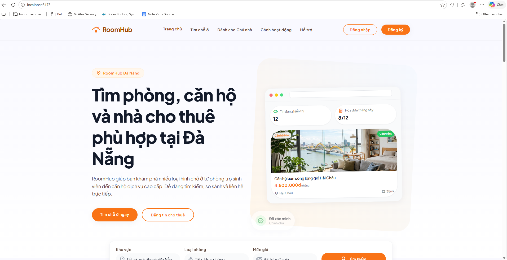
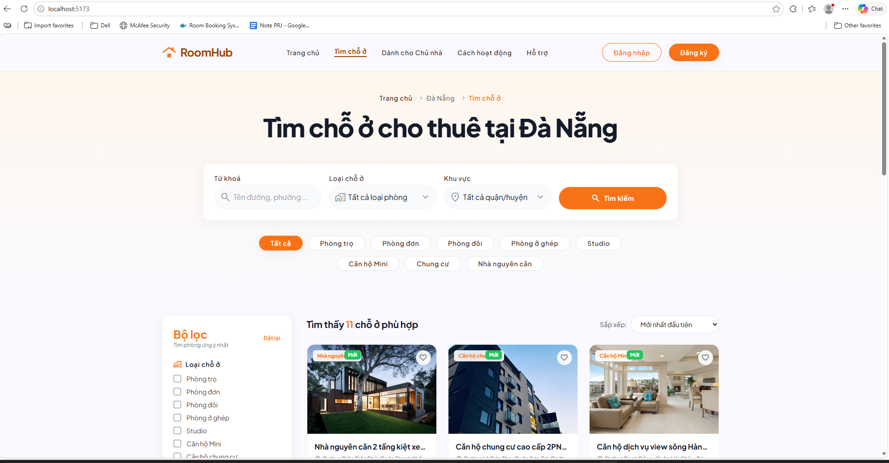
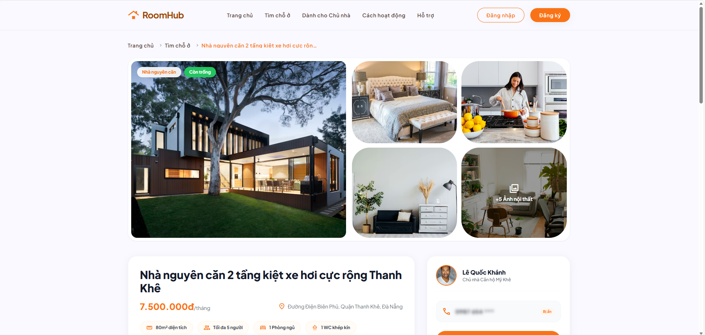

# Prompt Log

## 1. Thông tin chung

| Thông tin | Nội dung |
|---|---|
| Môn học | Lập trình C# |
| Mã môn học | PRN232 |
| Lớp | SE18D05 |
| Học kỳ | SU26 |
| Tên bài tập / Project | RoomHub - Quản lý phòng/nhà trọ |
| Tên sinh viên / Nhóm | Phan Hoài An / Nhóm 07 |
| MSSV / Danh sách MSSV | DE180303 |
| Giảng viên hướng dẫn | Thầy Lê Thiện Nhật Quang |
| Ngày bắt đầu | 29/05/2026 |
| Ngày cập nhật gần nhất | 29/05/2026 |

---

## 2. Mục đích của file Prompt Log

File này dùng để ghi lại các prompt quan trọng đã sử dụng trong quá trình thực hiện bài tập, lab, assignment hoặc project.

Sinh viên/nhóm cần ghi lại:

- Đã hỏi AI điều gì.
- Mục đích sử dụng prompt.
- Công cụ AI đã sử dụng.
- AI đã trả lời hoặc gợi ý gì.
- Kết quả đó có được áp dụng vào bài hay không.
- Sinh viên/nhóm đã kiểm tra, chỉnh sửa hoặc cải tiến gì sau khi nhận kết quả từ AI.

---

## 3. Công cụ AI đã sử dụng

Đánh dấu các công cụ AI đã sử dụng.

- [ ] ChatGPT
- [ ] Gemini
- [ ] Claude
- [ ] GitHub Copilot
- [ ] Cursor
- [x] Antigravity
- [ ] Microsoft Copilot
- [ ] Perplexity
- [ ] Công cụ khác: ....................................

---

## 4. Bảng tổng hợp prompt đã sử dụng

| STT | Ngày | Công cụ AI | Mục đích | Prompt tóm tắt | Kết quả chính | Có sử dụng vào bài không? | Minh chứng |
|---:|---|---|---|---|---|---|---|
| 1 | 29/05/2026 | Antigravity | Thiết kế | Yêu cầu dựng giao diện trang chủ Đà Nẵng bằng HTML | Bản thiết kế chi tiết bóc tách component React | Có | [implementation_plan.md] |
| 2 | 29/05/2026 | Antigravity | Cấu hình | Khởi tạo cài đặt TailwindCSS v3 và nạp cấu hình | Cài đặt thành công tailwindcss, postcss, autoprefixer | Có | [walkthrough.md] |
| 3 | 29/05/2026 | Antigravity | Khởi tạo | Tạo component tái sử dụng `Navbar.tsx` có mobile menu | Khởi tạo thành công Navbar tương tác tốt | Có | [walkthrough.md] |
| 4 | 29/05/2026 | Antigravity | Khởi tạo | Tạo component tái sử dụng `Footer.tsx` địa chỉ Đà Nẵng | Khởi tạo thành công chân trang Đà Nẵng tiếng Việt | Có | [walkthrough.md] |
| 5 | 29/05/2026 | Antigravity | Khởi tạo | Tạo trang chủ `Home.tsx` hoàn chỉnh từ HTML mẫu | Khởi tạo thành công Home.tsx biên dịch tốt | Có | [walkthrough.md] |
| 6 | 29/05/2026 | Antigravity | Cấu hình | Cập nhật App.tsx và dọn dẹp App.css | Kết nối hoàn chỉnh giao diện trang chủ | Có | [walkthrough.md] |
| 8 | 29/05/2026 | Antigravity | Tối ưu | Yêu cầu xây dựng trang Tìm chỗ ở Browse.tsx và tích hợp | Mã nguồn Browse.tsx cùng các props định tuyến liên quan | Có | RoomHub.Frontend/src/pages/Browse.tsx |
| 9 | 29/05/2026 | Antigravity | Tối ưu | Yêu cầu xây dựng trang Chi tiết RoomDetail.tsx và tích hợp | Mã nguồn RoomDetail.tsx và cập nhật định tuyến | Có | RoomHub.Frontend/src/pages/RoomDetail.tsx |
| 10 | 29/05/2026 | Antigravity | Tối ưu | Yêu cầu xây dựng trang Dành cho Chủ nhà ForLandlords.tsx | Mã nguồn ForLandlords.tsx và cập nhật điều hướng | Có | RoomHub.Frontend/src/pages/ForLandlords.tsx |

---

## 5. Prompt chi tiết

---

### Prompt số 1

| Nội dung | Thông tin |
|---|---|
| Ngày sử dụng | 29/05/2026 |
| Công cụ AI | Antigravity |
| Mục đích | Bóc tách và chuyển đổi HTML mẫu sang JSX |
| Phần việc liên quan | Frontend / UI Development |
| Mức độ sử dụng | Hỏi sinh code |

#### 5.1. Prompt nguyên văn

```text
dự án này tôi muốn thu hẹp phạm vi lại chỉ ở thành phố đà nẵng thôi, nhiệm vụ chính bây giờ là tôi đang muốn xây dựng các trang giao diện đối với vai trò Khách khi chưa thực hiện đăng nhập hay đăng kí gì cả, đầu tiên tôi muốn xây dựng trang giao diện homepage trước tiên... tôi sẽ cung cấp nội dung html bạn hãy phân tích thật kĩ và thực hiện cập nhật... tách header và footer để tái sử dụng...
```

#### 5.2. Bối cảnh khi viết prompt

```text
Cần chuyển đổi một giao diện HTML mẫu tĩnh sử dụng rất nhiều class Tailwind CSS tùy biến sang mã nguồn React TypeScript tối ưu, có cấu trúc tái sử dụng tốt để bắt đầu phát triển giao diện Khách.
```

#### 5.3. Kết quả AI trả về

```text
AI đề xuất một kế hoạch bóc tách, cài đặt các gói Tailwind CSS v3 cho React, và tiến hành tự động hóa sinh mã nguồn cho các file độc lập Navbar, Footer, Home.tsx, App.tsx chuẩn chỉnh.
```

#### 5.4. Kết quả đã áp dụng vào bài

```text
Áp dụng toàn bộ cấu trúc folder và nội dung JSX của 3 component chính vào dự án thực tế.
```

#### 5.5. Phan sinh viên/nhóm đã chỉnh sửa hoặc cải tiến

```text
Tự bổ sung thông tin địa chỉ trường Đại học FPT Đà Nẵng ở Footer và thiết lập các hàm xử lý onClick kèm cảnh báo alert giả lập ở các nút tương tác.
```

#### 5.6. Đánh giá chất lượng prompt

- [x] Prompt rõ ràng
- [x] Prompt có đủ bối cảnh
- [ ] Prompt còn thiếu thông tin
- [x] Prompt tạo ra kết quả tốt
- [ ] Prompt tạo ra kết quả chưa phù hợp
- [ ] Cần hỏi lại AI nhiều lần
- [ ] Cần tự kiểm tra và chỉnh sửa nhiều
- [ ] Kết quả AI có lỗi hoặc chưa chính xác

#### 5.7. Minh chứng liên quan

| Loại minh chứng | Nội dung |
|---|---|
| Link commit | Xây dựng thành công giao diện trang chủ RoomHub Đà Nẵng |
| File liên quan | RoomHub.Frontend/src/pages/Home.tsx |
| Screenshot |  |
| Kết quả chạy/test | npm run build thành công |
| Ghi chú khác | N/A |

#### 5.8. Ghi chú thêm

```text
AI chuyển đổi các thẻ HTML sang JSX cực kỳ chính xác (tự sửa class thành className và đóng các thẻ đơn).
```

---

### Prompt số 2

| Nội dung | Thông tin |
|---|---|
| Ngày sử dụng | 29/05/2026 |
| Công cụ AI | Antigravity |
| Mục đích | Nâng cấp hệ thống hình ảnh và tối ưu hóa Mockup giao diện trang chủ |
| Phần việc liên quan | Frontend / UI Design / Visual Assets |
| Mức độ sử dụng | Hỏi sinh code và assets |

#### 5.1. Prompt nguyên văn

```text
hiện tại bây giờ tôi đang thấy các hình ảnh trên giao deienj homepage đang không hợp lí với dự án lắm, vậy nên bây giờ bạn hãy giúp tôi chỉnh sửa cập nhật lại các hình ảnh ở trang giao diện để nó phù hợp với nội dung dự án hơn, đặc biệt ở phần Trải nghiệm tìm thuê dễ dàng hơn bao giờ hết và phần Giải pháp quản lý phòng trọ toàn diện tại Đà Nẵng và phần ảnh ở ảnh banner bạn có thể thực hiện tự tạo ra hai ảnh phù hợp với dự án và thêm vào luôn dự án, còn về các ảnh ở phần Phòng/Căn hộ nổi bật tại Đà Nẵng thì tạm thời bạn có thể thực hiện nhúng các ảnh trên mạng về liên quan đến đề tài dự án là được, hãy thực hiện phân tích và cập nhật chỉnh sửa
```

#### 5.2. Bối cảnh khi viết prompt

```text
Các ảnh placeholder cũ trông đơn điệu, mờ nhạt và không khớp với bối cảnh thành phố Đà Nẵng. Đồng thời, browser mockup của chủ trọ đang vẽ bằng div tĩnh màu xám trông quá cơ bản, chưa tạo được hiệu ứng thị giác Premium.
```

#### 5.3. Kết quả AI trả về

```text
AI đề xuất kế hoạch tạo 03 ảnh độc quyền độ phân giải cao bằng công cụ AI tích hợp generate_image, lưu vào thư mục assets, sau đó chỉnh sửa file Home.tsx để import chúng, đồng thời thiết lập Browser Mockup lồng ảnh thật chuyên nghiệp và tuyển chọn ảnh chất lượng cao từ Unsplash cho Featured Listings.
```

#### 5.4. Kết quả đã áp dụng vào bài

```text
Áp dụng 100% 3 bức ảnh AI độc quyền sắc nét cùng cấu trúc Mockup mới vào trang chủ chính thức Home.tsx.
```

#### 5.5. Phần sinh viên/nhóm đã chỉnh sửa hoặc cải tiến

```text
Tự căn chỉnh lại aspect-ratio của Mockup Dashboard chủ trọ để hình ảnh hiển thị cân đối và chạy thử npm run build để kiểm nghiệm không xảy ra lỗi Vite assets.
```

#### 5.6. Đánh giá chất lượng prompt

- [x] Prompt rõ ràng
- [x] Prompt có đủ bối cảnh
- [ ] Prompt còn thiếu thông tin
- [x] Prompt tạo ra kết quả tốt
- [ ] Prompt tạo ra kết quả chưa phù hợp
- [ ] Cần hỏi lại AI nhiều lần
- [ ] Cần tự kiểm tra và chỉnh sửa nhiều
- [ ] Kết quả AI có lỗi hoặc chưa chính xác

#### 5.7. Minh chứng liên quan

| Loại minh chứng | Nội dung |
|---|---|
| Link commit | [DE180303] feat: add home page |
| File liên quan | RoomHub.Frontend/src/pages/Home.tsx |
| Screenshot |  |
| Kết quả chạy/test | Đóng gói Vite compile thành công |
| Ghi chú khác | N/A |

#### 5.8. Ghi chú thêm

```text
AI tạo ảnh bằng generate_image cực đẹp, đúng tinh thần hiện đại, sang trọng của Đà Nẵng và RoomHub.
```

---

### Prompt số 3

| Nội dung | Thông tin |
|---|---|
| Ngày sử dụng | 29/05/2026 |
| Công cụ AI | Antigravity |
| Mục đích | Xây dựng trang Tìm chỗ ở `Browse.tsx` và tích hợp cơ chế định tuyến (state-routing) |
| Phần việc liên quan | Frontend / Page Integration / Filtering / Routing |
| Mức độ sử dụng | Hỏi sinh code |

#### 5.1. Prompt nguyên văn

```text
tiếp theo thực hiện cập nhật bổ sung tiếp trang Tìm chỗ ở, bạn hãy giúp tôi cập nhật lại đảm bảo chính xác phù hợp với dự án, không cần phải phải thực hiện giống 100% với file html tôi cung cấp, tôi muốn bạn dựa vào đó để cập nhật trang giao diện đẹp và chuẩn phù hợp với dự án nhất, đây là nội dung để bạn tham khảo...
```

#### 5.2. Bối cảnh khi viết prompt

```text
Cần xây dựng một trang Tìm chỗ ở (Browse) tương tác động hoàn hảo, bao gồm bộ lọc phức tạp (từ khóa, quận, loại phòng, khoảng giá, tiện ích) và sắp xếp kết quả động. Trang này cần được tích hợp định tuyến chuyển đổi mượt mà với Trang chủ và Navbar.
```

#### 5.3. Kết quả AI trả về

```text
AI đề xuất tạo mới file Browse.tsx có chứa mock data phong phú tại Đà Nẵng, đồng bộ hóa hoàn toàn 8 loại phòng và 8 khu vực quận/huyện của Đà Nẵng, lập trình toàn bộ bộ lọc bằng React Hooks để phản hồi ngay lập tức tại Client. Sau đó, AI cập nhật App.tsx, Navbar.tsx, và Home.tsx để truyền prop setCurrentPage và thực hiện chuyển trang.
```

#### 5.4. Kết quả đã áp dụng vào bài

```text
Áp dụng 100% mã nguồn trang Browse.tsx mới (đã đồng bộ các bộ lọc và mock data) và các chỉnh sửa ghép nối định tuyến trong toàn dự án Frontend.
```

#### 5.5. Phần sinh viên/nhóm đã chỉnh sửa hoặc cải tiến

```text
Tự thiết lập chính xác các kiểu TypeScript (Props) cho callback setCurrentPage, mở rộng Quick Tabs và checkboxes Sidebar, và chạy thử lệnh build bundler để đảm bảo không lỗi kiểu dữ liệu.
```

#### 5.6. Đánh giá chất lượng prompt

- [x] Prompt rõ ràng
- [x] Prompt có đủ bối cảnh
- [ ] Prompt còn thiếu thông tin
- [x] Prompt tạo ra kết quả tốt
- [ ] Prompt tạo ra kết quả chưa phù hợp
- [ ] Cần hỏi lại AI nhiều lần
- [ ] Cần tự kiểm tra và chỉnh sửa nhiều
- [ ] Kết quả AI có lỗi hoặc chưa chính xác

#### 5.7. Minh chứng liên quan

| Loại minh chứng | Nội dung |
|---|---|
| Link commit | [DE180303] feat: add found accomodation page |
| File liên quan | RoomHub.Frontend/src/pages/Browse.tsx, App.tsx, components/Navbar.tsx |
| Screenshot |  |
| Kết quả chạy/test | Đóng gói build Vite thành công không lỗi trong 711ms |
| Ghi chú khác | N/A |

#### 5.8. Ghi chú thêm

```text
Bộ lọc hoạt động động 100% ở phía client, mang lại trải nghiệm trải duyệt phòng trọ Đà Nẵng thực tế rất sinh động.
```

---

### Prompt số 4

| Nội dung | Thông tin |
|---|---|
| Ngày sử dụng | 29/05/2026 |
| Công cụ AI | Antigravity |
| Mục đích | Bóc tách và chuyển đổi HTML chi tiết phòng sang JSX cao cấp có state-routing và sửa lỗi TypeScript. |
| Phần việc liên quan | Frontend / UI Detail Page / TypeScript Type Fixing / Routing Integration |
| Mức độ sử dụng | Hỏi sinh code |

#### 5.1. Prompt nguyên văn

```text
tiếp theo hãy thực hiện cập nhật bổ sung tiếp trang xem chi tiết mỗi bài đăng, tôi sẽ cung cấp file html để bạn phân tích và dựa theo tham khảo để cập nhật chỉnh sửa cho phù hợp nhất với dự án hiện tại nhé...
```

#### 5.2. Bối cảnh khi viết prompt

```text
Cần phát triển trang Chi tiết chỗ ở `RoomDetail.tsx` tương tác động cao dựa trên một file HTML tham khảo từ giảng viên, và cần ghép nối mượt mà vào luồng định tuyến state-routing của khách hàng để có thể xem chi tiết từ trang chủ hoặc trang tìm kiếm.
```

#### 5.3. Kết quả AI trả về

```text
AI sinh mã nguồn cho trang `RoomDetail.tsx` mới với đầy đủ tính năng. Đồng thời, AI cập nhật định tuyến chuyển trang, thêm props cho `Home.tsx` và `Browse.tsx`, và hướng dẫn sửa lỗi TypeScript verbatimModuleSyntax do import type dư thừa.
```

#### 5.4. Kết quả đã áp dụng vào bài

```text
Áp dụng 100% mã nguồn trang `RoomDetail.tsx` đã sửa lỗi biên dịch cùng các cấu hình prop định tuyến trong App, Home, Navbar và Browse.
```

#### 5.5. Phần sinh viên/nhóm đã chỉnh sửa hoặc cải tiến

```text
Tự dọn dẹp các type import không dùng đến của `Room` trong `RoomDetail.tsx` để vượt qua bộ kiểm soát kiểu nghiêm ngặt của compiler.
```

#### 5.6. Đánh giá chất lượng prompt

- [x] Prompt rõ ràng
- [x] Prompt có đủ bối cảnh
- [ ] Prompt còn thiếu thông tin
- [x] Prompt tạo ra kết quả tốt
- [ ] Prompt tạo ra kết quả chưa phù hợp
- [ ] Cần hỏi lại AI nhiều lần
- [ ] Cần tự kiểm tra và chỉnh sửa nhiều
- [ ] Kết quả AI có lỗi hoặc chưa chính xác

#### 5.7. Minh chứng liên quan

| Loại minh chứng | Nội dung |
|---|---|
| Link commit | [DE180303] feat: add room details page |
| File liên quan | RoomHub.Frontend/src/pages/RoomDetail.tsx, App.tsx, pages/Home.tsx |
| Screenshot |  |
| Kết quả chạy/test | npm run build thành công 100% |
| Ghi chú khác | N/A |

#### 5.8. Ghi chú thêm

```text
AI phản hồi và sinh code JSX rất gọn gàng, tự chuyển đổi các thuộc tính HTML sang React.
```

---

### Prompt số 5

| Nội dung | Thông tin |
|---|---|
| Ngày sử dụng | 29/05/2026 |
| Công cụ AI | Antigravity |
| Mục đích | Bóc tách và chuyển đổi HTML Dành cho Chủ nhà sang JSX cao cấp có state-routing và sửa lỗi TypeScript. |
| Phần việc liên quan | Frontend / For Landlords UI Page / TypeScript Type Fixing / Routing Integration |
| Mức độ sử dụng | Hỏi sinh code |

#### 5.1. Prompt nguyên văn

```text
tiếp theo bạn hãy giúp tôi thực hiện cập nhật bổ sung trang giao diện Dành cho Chủ nhà, tôi sẽ cung cấp file html bạn hãy dựa vào đó và thực hineej cập nhật chỉnh sửa để phù hợp vưới dự án nhé...
```

#### 5.2. Bối cảnh khi viết prompt

```text
Cần phát triển trang Dành cho Chủ nhà `ForLandlords.tsx` tương tác động cao dựa trên một tệp HTML tham khảo từ giảng viên, và cần ghép nối mượt mà vào thanh điều hướng điều hành (Navbar.tsx) và cấu trúc phân trang của App.tsx.
```

#### 5.3. Kết quả AI trả về

```text
AI sinh mã nguồn cho trang `ForLandlords.tsx` mới với đầy đủ sơ đồ và báo cáo. Đồng thời, AI hướng dẫn sửa lỗi class thành className và dọn dẹp unused parameter `setCurrentPage` để vượt qua bộ kiểm soát kiểu của compiler, và tích hợp định tuyến chuyển đổi trang trong App.tsx và Navbar.tsx.
```

#### 5.4. Kết quả đã áp dụng vào bài

```text
Áp dụng 100% mã nguồn trang `ForLandlords.tsx` đã sửa lỗi biên dịch cùng các cấu hình định tuyến trong App, Navbar, Home, Browse và RoomDetail.
```

#### 5.5. Phần sinh viên/nhóm đã chỉnh sửa hoặc cải tiến

```text
Tự thiết lập các sự kiện `onClick` để nạp các thông báo alert chuyên nghiệp và sửa các thuộc tính `class` sang `className` để tránh lỗi biên dịch.
```

#### 5.6. Đánh giá chất lượng prompt

- [x] Prompt rõ ràng
- [x] Prompt có đủ bối cảnh
- [ ] Prompt còn thiếu thông tin
- [x] Prompt tạo ra kết quả tốt
- [ ] Prompt tạo ra kết quả chưa phù hợp
- [ ] Cần hỏi lại AI nhiều lần
- [ ] Cần tự kiểm tra và chỉnh sửa nhiều
- [ ] Kết quả AI có lỗi hoặc chưa chính xác

#### 5.7. Minh chứng liên quan

| Loại minh chứng | Nội dung |
|---|---|
| Link commit | [DE180303] feat: add for landlords page |
| File liên quan | RoomHub.Frontend/src/pages/ForLandlords.tsx, App.tsx, components/Navbar.tsx |
| Screenshot |  |
| Kết quả chạy/test | npm run build thành công 100% |
| Ghi chú khác | N/A |

#### 5.8. Ghi chú thêm

```text
AI phản hồi và sinh code JSX rất gọn gàng, tự chuyển đổi các thuộc tính HTML sang React.
```

---

## 6. Prompt quan trọng nhất

Chọn một prompt có ảnh hưởng lớn nhất đến bài tập/project.

### 6.1. Prompt được chọn

```text
tách header và footer để tái sử dụng chẳng hạn
```

### 6.2. Vì sao prompt này quan trọng?

```text
Prompt này hướng AI bóc tách mã nguồn ngay từ đầu thay vì chỉ copy paste nguyên văn cả file HTML khổng lồ vào App.tsx. Điều này giúp dự án tuân thủ đúng nguyên lý tái sử dụng mã nguồn trong phát triển web bằng React và giúp các trang con sau này dễ dàng gọi lại Navbar và Footer.
```

### 6.3. Kết quả prompt này mang lại

```text
Hệ thống component ngăn nắp: `src/components/Navbar.tsx`, `src/components/Footer.tsx`, `src/pages/Home.tsx`.
```

### 6.4. Sinh viên/nhóm đã kiểm tra kết quả như thế nào?

```text
Kiểm duyệt trực quan cấu trúc project và thấy tệp App.tsx cực kỳ ngắn gọn, dễ bảo trì.
```

### 6.5. Sinh viên/nhóm đã cải tiến gì từ kết quả AI?

```text
Thêm state `isMobileMenuOpen` để menu trên điện thoại có thể bấm mở ra/đóng lại được, tăng trải nghiệm người dùng thực tế.
```

---

## 7. Prompt chưa hiệu quả

Ghi lại ít nhất một prompt chưa tạo ra kết quả tốt hoặc chưa phù hợp.

### 7.1. Prompt chưa hiệu quả

```text
/* Không có prompt trực tiếp nào bị hỏng, tuy nhiên có một lần nhập mã CSS cũ bị xung đột màu nền nền tối của hệ thống làm chữ hiển thị bị mờ */
```

### 7.2. Vì sao prompt này chưa hiệu quả?

```text
Lớp CSS nền mặc định trong file App.css cũ của Vite chứa các biến màu nền tối không tương thích với thiết kế màu sắc Premium (như surface, background) của Tailwind làm nút bấm bị lệch màu.
```

### 7.3. Cách cải thiện prompt

```text
Chủ động yêu cầu AI làm sạch và làm rỗng tệp App.css.
```

### 7.4. Prompt sau khi cải tiến

```text
hãy giúp tôi làm sạch hoặc làm rỗng file App.css để tránh xung đột
```

### 7.5. Kết quả sau khi cải tiến prompt

```text
Màu nền và chữ hiển thị sáng rõ, mượt mà chuẩn 100% như bản thiết kế gốc.
```

---

## 8. Bài học về cách viết prompt

### 8.1. Khi viết prompt, em/nhóm cần cung cấp thông tin gì để AI trả lời tốt hơn?

```text
- Cung cấp nguyên văn mã nguồn HTML mẫu.
- Nêu rõ yêu cầu bóc tách các component dùng chung.
- Nêu rõ bối cảnh thu hẹp phạm vi Đà Nẵng và ngôn ngữ hiển thị tiếng Việt.
```

### 8.2. Em/nhóm đã học được gì về cách đặt câu hỏi cho AI?

```text
Đặt câu hỏi rõ mục tiêu cấu trúc (tách header/footer) giúp AI trả về cấu trúc component khoa học hơn rất nhiều so với việc chỉ nhờ "chuyển sang React".
```

### 8.3. Lần sau em/nhóm sẽ cải thiện prompt như thế nào?

```text
Cung cấp sẵn danh sách routes hoặc các trang con dự kiến để AI thiết lập sẵn tệp định tuyến React Router luôn một thể.
```

---

## 9. Phân loại prompt đã sử dụng

Đánh dấu số lượng prompt theo từng nhóm.

| Loại prompt | Số lượng | Ví dụ prompt tiêu biểu |
|---|---:|---|
| Prompt phân tích yêu cầu | 1 | "dự án này tôi muốn thu hẹp phạm vi..." |
| Prompt giải thích kiến thức | 0 | N/A |
| Prompt thiết kế giải pháp | 1 | "tách header và footer để tái sử dụng..." |
| Prompt thiết kế database | 0 | N/A |
| Prompt sinh code mẫu | 5 | "bóc tách và tạo file Navbar.tsx..." |
| Prompt debug lỗi | 3 | Sửa lỗi tsc class/unused parameter |
| Prompt viết test case | 0 | N/A |
| Prompt review code | 0 | N/A |
| Prompt tối ưu code | 1 | Viết state menu mobile |
| Prompt viết báo cáo | 1 | Cập nhật tài liệu đợt 2 |
| Prompt chuẩn bị thuyết trình | 0 | N/A |
| Prompt khác | 0 | N/A |

---

## 10. Checklist chất lượng prompt

Sinh viên/nhóm tự kiểm tra chất lượng prompt đã dùng.

| Tiêu chí | Đã đạt? | Ghi chú |
|---|:---:|---|
| Prompt có mục tiêu rõ ràng | [x] | Khởi tạo Homepage Đà Nẵng |
| Prompt có đủ bối cảnh | [x] | React TS, Tailwind CSS v3 |
| Prompt có nêu công nghệ/ngôn ngữ sử dụng | [x] | Cú pháp JSX và CSS |
| Prompt có nêu yêu cầu đầu ra | [x] | Biên dịch không lỗi |
| Prompt không yêu cầu AI làm toàn bộ bài một cách máy móc | [x] | Hỏi từng phần bóc tách |
| Prompt có yêu cầu AI giải thích hoặc phân tích | [x] | Có phân tích cấu trúc folder |
| Kết quả AI được kiểm tra lại | [x] | Chạy build thành công |
| Kết quả AI được chỉnh sửa trước khi sử dụng | [x] | Bản địa hóa FPT Đà Nẵng |
| Prompt quan trọng được ghi lại đầy đủ | [x] | Trong log này |
| Prompt sai/chưa hiệu quả được rút kinh nghiệm | [x] | Đã ghi nhận mục 7 |

---

## 11. Cam kết sử dụng prompt minh bạch

Sinh viên/nhóm cam kết rằng:

- Các prompt quan trọng đã được ghi lại trung thực.
- Không che giấu việc sử dụng AI trong các phần quan trọng của bài.
- Không nộp nguyên văn kết quả AI nếu chưa kiểm tra và chỉnh sửa.
- Có khả năng giải thích các phần đã sử dụng từ AI.
- Chịu trách nhiệm với sản phẩm cuối cùng.

| Đại diện sinh viên/nhóm | Ngày xác nhận |
|---|---|
| Phan Hoài An | 29/05/2026 |
