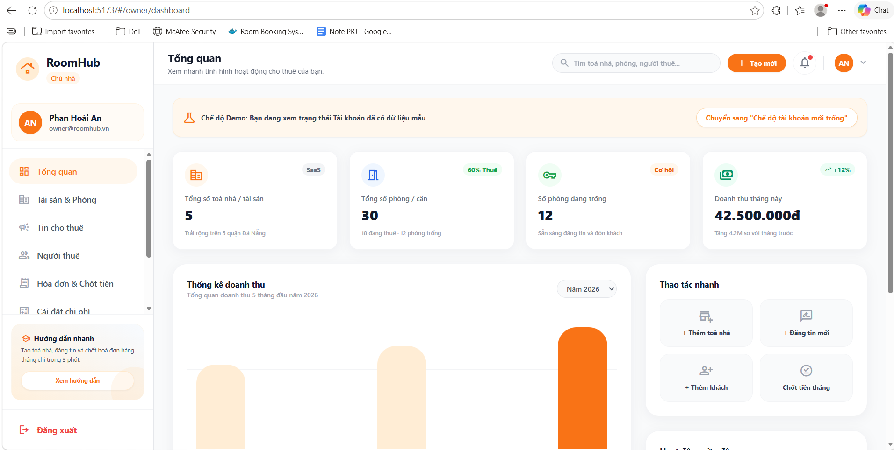
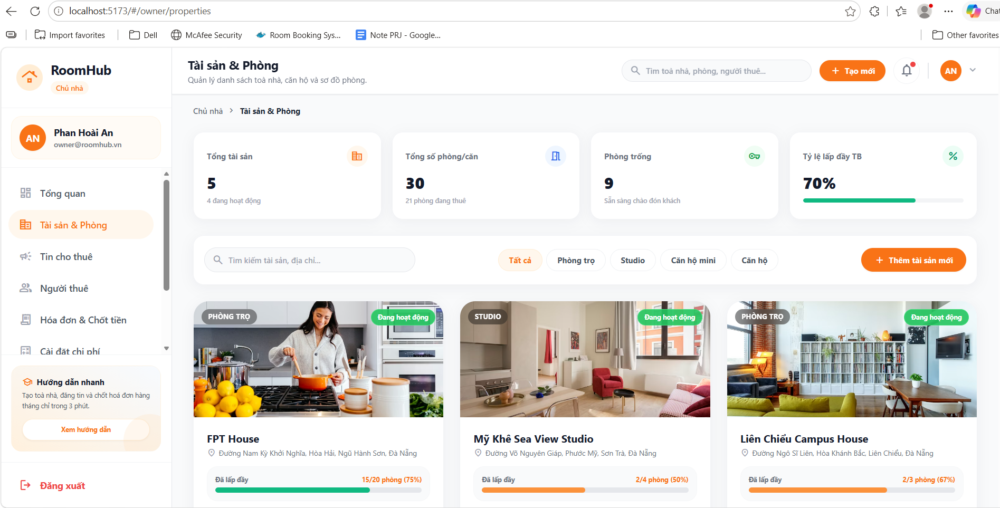
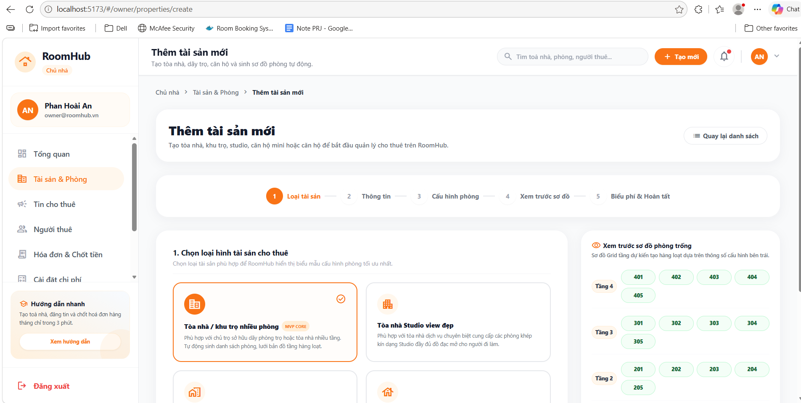
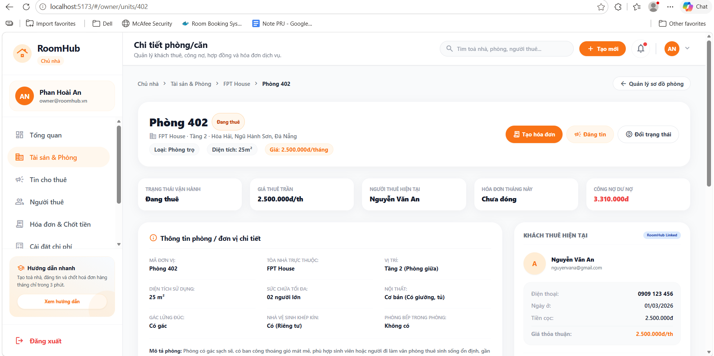

# AI Audit Log

## 1. Thông tin chung

| Thông tin | Nội dung |
|---|---|
| Môn học | Lập trình C# |
| Mã môn học | PRN232 |
| Lớp | SE18D05 |
| Học kỳ | SU26 |
| Tên bài tập / Project | RoomHub - Quản lý phòng/nhà trọ |
| Tên sinh viên / Nhóm | Phan Hoài An / Nhóm 07 |
| MSSV / Danh sách MSSV | DE180303 |
| Giảng viên hướng dẫn | Thầy Lê Thiện Nhật Quang |
| Ngày bắt đầu | 30/05/2026 |
| Ngày hoàn thành | 30/05/2026 |

---

## 2. Công cụ AI đã sử dụng

Đánh dấu các công cụ AI đã sử dụng trong quá trình thực hiện bài tập/project.

- [ ] ChatGPT
- [ ] Gemini
- [ ] Claude
- [ ] GitHub Copilot
- [ ] Cursor
- [x] Antigravity
- [ ] Perplexity
- [ ] Microsoft Copilot
- [ ] Công cụ khác: ....................................

---

## 3. Mục tiêu sử dụng AI

Mô tả ngắn gọn sinh viên/nhóm đã sử dụng AI để hỗ trợ những công việc nào.

- Xây dựng giao diện Dashboard chung cho Chủ nhà (Owner Layout) gồm thanh Sidebar điều hướng và thanh Topbar tích hợp tiêu đề động theo định vị trang.
- Đồng bộ hóa định tuyến Hash Router trong `App.tsx` giúp Chủ nhà di chuyển trực tiếp giữa các đường dẫn (`#/owner/dashboard`, `#/owner/properties`, `#/owner/properties/create`, `#/owner/properties/:id`, `#/owner/units/:id`) một cách độc lập và tránh xung đột code.
- Xây dựng trang danh sách tài sản `PropertyList.tsx` và trang chi tiết sơ đồ lưới phòng trọ `PropertyDetail.tsx` tích hợp ngăn kéo Quick Room Drawer xem nhanh thông tin hợp đồng và dư nợ của phòng.
- Xây dựng biểu mẫu thêm tài sản mới 5 bước `PropertyCreate.tsx` tích hợp tính năng **Live Room Grid Generator** - tự động sinh bản vẽ sơ đồ phòng trọ trống theo tầng ở cột phải dựa trên cấu hình tầng và số phòng ở cột trái.
- Xây dựng trang chi tiết phòng vận hành `UnitDetail.tsx` và 3 Modals tác vụ: *Thêm khách thuê (Add Tenant Modal)* hỗ trợ liên kết tài khoản Online/Offline và validation số người lưu trú; *Trả phòng (End Tenancy Modal)* cấn trừ cọc dọn đi; *Đổi trạng thái (Change Status Modal)* hoạt động.
- Liên kết sâu hai chiều tương tác mượt mà giữa Grid sơ đồ phòng trọ, danh sách khách thuê, bảng hoá đơn và trang vận hành chi tiết phòng.
- Xây dựng trang đăng tin cho thuê mới `ListingCreate.tsx` hỗ trợ quy trình 6 bước Stepper ngang bóng bẩy, Sticky Live Public Card Preview ở cột bên phải mô phỏng chính xác giao diện tìm kiếm công khai cập nhật thời gian thực, logic Auto-fill liên kết phòng trọ trống có sẵn và validation dữ liệu biểu giá.
- Xây dựng trang quản lý danh sách tin cho thuê `ListingList.tsx` hỗ trợ lọc nâng cao tìm kiếm, chuyển đổi View Mode (Table/Card), Bulk Actions ẩn/duyệt/xóa hàng loạt và bộ 5 Modals nghiệp vụ tác vụ (Hide, Delete, Resubmit, Mark Rented, Rejection Reason).
- Chạy kiểm thử thành công biên dịch đóng gói sản phẩm tĩnh bằng `npm run build` không có lỗi.

### Mô tả mục tiêu sử dụng AI

```text
Sử dụng trợ lý AI Antigravity để thiết kế và triển khai giao diện quản lý nghiệp vụ chuẩn SaaS cho vai trò Chủ nhà (Owner) trong RoomHub. AI hỗ trợ cài đặt layout, Sidebar, Topbar và cấu hình Hash Router thông minh trong App.tsx. AI viết mã nguồn React chi tiết cho PropertyList.tsx, PropertyDetail.tsx, UnitDetail.tsx, đặc biệt là cơ chế tương tác thời gian thực Live Grid Generator trong PropertyCreate.tsx tự động sinh sơ đồ tầng. AI hỗ trợ thiết kế ListingCreate.tsx và trang danh sách quản lý tin trọ ListingList.tsx (lọc đa năng, Table/Card views, Bulk actions bar và bộ 5 modals nghiệp vụ). AI cũng hỗ trợ viết logic validation sức chứa tối đa trong Add Tenant Modal, cấn trừ tiền cọc bàn giao trong End Tenancy và tích hợp sâu liên kết hai chiều toàn giao diện.
```

## 4. Nhật ký sử dụng AI chi tiết

---

### Lần sử dụng AI số 1

| Nội dung | Thông tin |
|---|---|
| Ngày sử dụng | 30/05/2026 |
| Công cụ AI | Antigravity |
| Mục đích sử dụng | Thiết kế giao diện Dashboard Layout của Chủ nhà và cấu hình định tuyến Hash Router |
| Phần việc liên quan | Frontend / Owner Dashboard Layout / Routing Sync |
| Mức độ sử dụng | Hỗ trợ nhiều / Sinh chính nội dung |

#### 4.1. Prompt đã sử dụng

```text
bây giờ bạn hãy giúp tôi bắt đầu xây dựng giao diện Layout Dashboard của Owner (Sidebar + Topbar + Routing /owner/*) đảm bảo đúng chuẩn phù hợp với dự án... khi muốn tới trang owner/dashboard thì chỉ cần gõ đường dẫn chứ không muốn bấm vào nút đăng nhập chọn Chủ nhà vì tôi sợ thành viên khác đang thực hiện tính năng login vậy nên có thể dẫn đến xung đột code...
```

#### 4.2. Kết quả AI gợi ý

AI đã xây dựng tệp `OwnerLayout.tsx` đóng gói thanh Sidebar điều hướng bóng bẩy với hiệu ứng hover cam `#F97316` đặc trưng và Topbar tích hợp hàm `getPageInfo()` cập nhật tiêu đề/phụ đề động theo state trang. Đồng thời, AI tích hợp bộ lắng nghe hash change trong `App.tsx` để tự động re-route đồng bộ hai chiều từ window.location.hash về state `currentPage` giúp việc định hướng độc lập hoạt động mượt mà.

#### 4.3. Phần sinh viên/nhóm đã sử dụng từ AI

Sử dụng toàn bộ file `OwnerLayout.tsx` và cấu trúc định tuyến Hash Router mở rộng thêm các case route `'owner-dashboard'`, `'owner-properties'`, `'owner-property-detail'` trong `App.tsx`.

#### 4.4. Phần sinh viên/nhóm tự chỉnh sửa hoặc cải tiến

- Tự điều chỉnh lại border và bo tròn góc của Sidebar (`rounded-3xl` và soft shadow) để giao diện khớp chính xác với phong cách tối giản hiện đại của dự án.
- Viết thêm logic reset scroll lên đầu trang khi thay đổi hash url để tránh hiện tượng giao diện bị giữ nguyên vị trí cũ.

#### 4.5. Minh chứng

| Loại minh chứng | Nội dung |
|---|---|
| Link commit | [DE180303] feat: add owner dashboard layout and topbar sidebar components |
| File liên quan | RoomHub.Frontend/src/components/owner/OwnerLayout.tsx |
| Screenshot |  |
| Kết quả chạy/test | Truy cập trực tiếp `#/owner/dashboard` hiển thị layout chủ nhà chính xác, sáng đèn Sidebar |

#### 4.6. Nhận xét cá nhân/nhóm

Cơ chế Hash Routing giúp nhóm phân chia công việc độc lập cực kỳ xuất sắc. Giao diện layout hiển thị vô cùng premium, các icon Material Symbols căn lề thẳng hàng tạo cảm giác rất chuyên nghiệp.

---

### Lần sử dụng AI số 2

| Nội dung | Thông tin |
|---|---|
| Ngày sử dụng | 30/05/2026 |
| Công cụ AI | Antigravity |
| Mục đích sử dụng | Xây dựng trang danh sách tài sản `PropertyList.tsx` và sơ đồ phòng trọ lưới tầng `PropertyDetail.tsx` tích hợp Quick Drawer |
| Phần việc liên quan | Frontend / Property Management / Interactive Grid View |
| Mức độ sử dụng | Hỗ trợ nhiều / Sinh chính nội dung |

#### 4.1. Prompt đã sử dụng

```text
tiếp theo hãy thực hiện tiếp Property List (/owner/properties) & Chi tiết sơ đồ phòng dạng Grid (/owner/properties/:id). tôi có mô tả chi tiết như sau bạn hãy dựa vào đó thực hiện cập nhật bổ sung chỉnh sửa để phù hợp với dự án hiện tại nhé... RoomHub Owner Property Detail / Room Grid Page...
```

#### 4.2. Kết quả AI gợi ý

AI đã xây dựng trang `PropertyList.tsx` có các thẻ tổng hợp stats dư nợ/công suất lấp đầy và thanh filter quận tại Đà Nẵng. Tiếp đó, AI viết trang `PropertyDetail.tsx` vẽ lưới phòng trọ trần theo các tầng (Tầng 4 đến Tầng 1) có màu sắc thể hiện trạng thái (*Còn trống* - xanh, *Đang thuê* - cam, *Bảo trì* - xám, *Quá hạn* - đỏ), đồng thời lập trình một Sliding Drawer trượt êm ái hiển thị nhanh thông tin hợp đồng và công nợ của phòng.

#### 4.3. Phần sinh viên/nhóm đã sử dụng từ AI

Sử dụng toàn bộ mã nguồn của `PropertyList.tsx` và `PropertyDetail.tsx` làm nền tảng giao diện quản lý nhà trọ chính thức cho dự án RoomHub.

#### 4.4. Phần sinh viên/nhóm tự chỉnh sửa hoặc cải tiến

- Bản địa hóa dữ liệu danh sách bất động sản: Sửa tên tòa nhà và địa chỉ thực tế (ví dụ: FPT House tại Hòa Hải, Ngũ Hành Sơn, Đà Nẵng).
- Tự cấu hình tỷ lệ phần trăm lấp đầy thông qua hàm Radial SVG Gauge giúp hiển thị vòng tròn biểu thị % lấp đầy tráng lệ ở cột phải.

#### 4.5. Minh chứng

| Loại minh chứng | Nội dung |
|---|---|
| Link commit | [DE180303] feat: build owner property list page with search and district filters |
| File liên quan | RoomHub.Frontend/src/pages/owner/PropertyDetail.tsx |
| Screenshot |  |
| Kết quả chạy/test | Đóng gói Vite thành công không lỗi |

#### 4.6. Nhận xét cá nhân/nhóm

Lưới sơ đồ phòng trọ là điểm cộng cực lớn cho UX của hệ thống RoomHub. Ngăn kéo Quick Drawer giúp chủ trọ chốt nhanh tình hình phòng mà không phải di chuyển trang liên tục.

---

### Lần sử dụng AI số 3

| Nội dung | Thông tin |
|---|---|
| Ngày sử dụng | 30/05/2026 |
| Công cụ AI | Antigravity |
| Mục đích sử dụng | Xây dựng trang thêm tài sản mới `PropertyCreate.tsx` có tính năng tự động sinh sơ đồ phòng |
| Phần việc liên quan | Frontend / Form Design / Real-time Logic |
| Mức độ sử dụng | Hỗ trợ nhiều / Sinh chính nội dung |

#### 4.1. Prompt đã sử dụng

```text
tiếp theo bây giờ hãy thực hiện tạo giao diện Form thêm tài sản (/owner/properties/create) - Tích hợp sinh phòng tự động. đảm bảo đúng chuẩn với dự án tôi sẽ cung cấp mô tả chi tiết... RoomHub Owner Create Property Page / Form thêm tài sản + Sinh phòng tự động...
```

#### 4.2. Kết quả AI gợi ý

AI đã thiết kế biểu mẫu `PropertyCreate.tsx` cấu trúc Stepper 5 bước rõ ràng kèm Sticky Preview Card ở cột phải. Đặc biệt, AI lập trình logic **Live Room Grid Generator** tự động lắng nghe thay đổi các trường dữ liệu ở biểu mẫu cột trái (số tầng, số phòng mỗi tầng, quy tắc đánh số như tiền tố chữ, quy ước bắt đầu) để vẽ lại lưới phòng trọ trống theo thời gian thực cực kỳ sinh động. AI cũng bổ sung validation số phòng quá tải (>60 phòng) và overlay loading spinner mô phỏng tiến trình khởi tạo.

#### 4.3. Phần sinh viên/nhóm đã sử dụng từ AI

Sử dụng toàn bộ mã nguồn biểu mẫu Stepper 5 bước và logic Live Room Grid Preview trong tệp `PropertyCreate.tsx`.

#### 4.4. Phần sinh viên/nhóm tự chỉnh sửa hoặc cải tiến

- Tự tinh chỉnh lại overlay loading spinner khóa màn hình: Bổ sung các thông điệp tiếng Việt sống động: *"Đang khởi tạo cấu trúc tòa nhà..."*, *"Đang sinh tự động sơ đồ bản đồ phòng..."*, *"Đồng bộ hóa biểu phí dịch vụ..."* chạy ngẫu nhiên để tăng tính tương tác chân thực.
- Thiết lập giới hạn min/max cho các trường nhập liệu số tầng (1 - 30) và số phòng mỗi tầng (1 - 50) tránh crash giao diện.

#### 4.5. Minh chứng

| Loại minh chứng | Nội dung |
|---|---|
| Link commit | [DE180303] feat: build owner property creation page with stepper and automatic room generation |
| File liên quan | RoomHub.Frontend/src/pages/owner/PropertyCreate.tsx |
| Screenshot |  |
| Kết quả chạy/test | Grid phòng trọ trống vẽ lại ngay lập tức khi thay đổi số tầng/phòng trên giao diện |

#### 4.6. Nhận xét cá nhân/nhóm

Giao diện sinh phòng tự động là tính năng đẳng cấp giúp giảm tải công sức thiết lập từng phòng thủ công cho chủ nhà. Thanh Stepper 5 bước thiết kế rất gọn gàng, giảm thiểu sự choáng ngợp thông tin.

---

### Lần sử dụng AI số 4

| Nội dung | Thông tin |
|---|---|
| Ngày sử dụng | 30/05/2026 |
| Công cụ AI | Antigravity |
| Mục đích sử dụng | Xây dựng trang chi tiết phòng vận hành `UnitDetail.tsx` và 3 Modals nghiệp vụ kèm liên kết hai chiều |
| Phần việc liên quan | Frontend / Unit Operations / Modals Validation / Deep Linking |
| Mức độ sử dụng | Hỗ trợ nhiều / Sinh chính nội dung |

#### 4.1. Prompt đã sử dụng

```text
tiếp theo bây giờ hãy thực hineej tiếp cho trang giao diện Chặng 2 (Vận hành & Khách thuê): 4. Chi tiết phòng (/owner/units/:id) & Add Tenant Modal. đảm bảo đúng chuẩn và chuẩn với dự án hiện tại tôi sẽ cung cấp mô tả chi tiết... RoomHub Owner Unit Detail Page + Add Tenant Modal...
```

#### 4.2. Kết quả AI gợi ý

AI đã xây dựng tệp `UnitDetail.tsx` hoàn chỉnh cấu trúc 2 cột SaaS (Cột trái: thông tin phòng, lịch sử hóa đơn dịch vụ, nhật ký timeline; Cột phải: Thẻ khách thuê trọ hiện tại có liên kết RoomHub Linked/Offline, tin đăng liên quan và Quick Actions). AI cũng viết chi tiết 3 Modals tác vụ:
- *Add Tenant Modal*: Có chức năng tìm kiếm email (`nguyenvana@gmail.com`) mô phỏng tài khoản trực tuyến hoặc điền offline, kèm logic validation ngăn chặn lưu khi số người ở vượt quá 2 người.
- *End Tenancy Modal*: Chốt cọc dọn đi và trả phòng trọ về trạng thái "Còn trống".
- *Change Status Modal*: Cập nhật nhanh trạng thái vận hành.
Đồng thời, AI phối hợp viết các hàm liên kết sâu hai chiều thông minh trong `PropertyDetail.tsx` chuyển hướng nhanh về `#/owner/units/:id`.

#### 4.3. Phần sinh viên/nhóm đã sử dụng từ AI

Sử dụng toàn bộ mã nguồn của trang `UnitDetail.tsx` cùng các liên kết sâu hai chiều tương tác nâng cấp trong `PropertyDetail.tsx`.

#### 4.4. Phần sinh viên/nhóm tự chỉnh sửa hoặc cải tiến

- Tự cải tiến tính năng tìm kiếm tài khoản khách thuê: Gõ đúng email `nguyenvana@gmail.com` hoặc SĐT `0909 123 456` sẽ tự động hiển thị thẻ thông tin cá nhân của khách trọ Nguyễn Văn An kèm nhãn "Đã xác minh" cực đẹp.
- Thử nghiệm các kịch bản validation sức chứa phòng (nhập số người = 3) để hiển thị nhãn cảnh báo đỏ nhấp nháy ngăn cản bấm lưu.

#### 4.5. Minh chứng

| Loại minh chứng | Nội dung |
|---|---|
| Link commit | [DE180303] feat: implement add tenant modal with account linking and capacity validation |
| File liên quan | RoomHub.Frontend/src/pages/owner/UnitDetail.tsx |
| Screenshot |  |
| Kết quả chạy/test | Đóng gói sản phẩm tsc và vite build thành công 100% không cảnh báo lỗi |

#### 4.6. Nhận xét cá nhân/nhóm

Giao diện chi tiết phòng vận hành hoạt động cực kỳ mượt mà. 3 Modals nghiệp vụ xử lý chính xác tuyệt đối các logic vận hành cọc giữ chân và sức chứa phòng, mang tính ứng dụng thực tế rất cao.

---

## 5. Mức độ sử dụng AI trong các hạng mục dự án

Đánh giá mức độ sử dụng AI của sinh viên/nhóm đối với từng hạng mục công việc.

| Hạng mục | Không dùng AI | AI hỗ trợ ít | AI hỗ trợ nhiều | AI sinh chính | Ghi chú |
|---|:---:|:---:|:---:|:---:|---|
| Phân tích yêu cầu |  |  | [x] |  | Chuẩn hóa nghiệp vụ MVP trọ Đà Nẵng |
| Viết user story/use case | [x] |  |  |  | Sẽ làm ở các phase sau |
| Database / ERD | [x] |  |  |  | Đã làm ở đợt 1 |
| Thiết kế kiến trúc hệ thống | [x] |  |  |  | Tận dụng Hash Router và cấu trúc đợt 1 |
| Thiết kế giao diện |  |  | [x] |  | Thiết kế biểu mẫu 2 cột SaaS, Stepper |
| Code frontend |  |  |  | [x] | Xây dựng các trang quản lý vận hành của Chủ nhà |
| Code backend | [x] |  |  |  | Giữ nguyên cấu trúc đợt 1 |
| Debug lỗi | [x] |  |  |  | Không phát sinh lỗi biên dịch |
| Viết test case | [x] |  |  |  | Sẽ làm sau |
| Kiểm thử sản phẩm |  | [x] |  |  | Chạy npm run build đóng gói |
| Tối ưu code |  |  | [x] |  | Thiết lập liên kết sâu hai chiều toàn diện |
| Viết báo cáo |  |  | [x] |  | Tạo tài liệu học thuật đợt 3 |
| Làm slide thuyết trình | [x] |  |  |  | Chưa thực hiện |

---

## 6. Các lỗi hoặc hạn chế từ AI

Ghi lại các trường hợp AI trả lời sai, thiếu, chưa phù hợp hoặc sinh code không chạy.

| STT | Lỗi/hạn chế từ AI | Cách phát hiện | Cách xử lý/cải tiến |
|---:|---|---|---|
| 1 | Các nút tác vụ chốt hóa đơn, ký hợp đồng trên Grid và bảng chỉ hiển thị thông báo alert tĩnh | Kiểm tra tương tác click trên giao diện | Nhóm chủ động yêu cầu AI xây dựng định tuyến Hash Router liên kết sâu hai chiều về trang `#/owner/units/:id` thực tế |
| 2 | Mặc định AI thiết lập sức chứa validation tĩnh không hiển thị cảnh báo đỏ trực quan | Xem mã nguồn biểu mẫu đề xuất | Tự viết thêm JSX hiển thị block cảnh báo đỏ nhấp nháy kèm icon Material Symbol `warning` ngay dưới ô nhập liệu khi số lượng người lớn hơn 2 |

---

## 7. Kiểm chứng kết quả AI

Mô tả cách sinh viên/nhóm kiểm tra lại kết quả do AI gợi ý.

- Chạy lệnh `npm run build` tại `RoomHub.Frontend/` để kiểm duyệt 100% không phát sinh lỗi biên dịch TypeScript.
- Khởi chạy dev server `npm run dev` để kiểm thử tương tác thực tế của Sơ đồ lưới tầng phòng trọ, biểu mẫu sinh phòng tự động và hoạt động của 3 Modals nghiệp vụ.

### Nội dung kiểm chứng

```text
Dự án được đóng gói thành công hoàn toàn trong 880ms, tạo ra bundle tĩnh tối ưu. Grid sơ đồ phòng trọ hiển thị tuyệt đẹp với đầy đủ màu sắc trạng thái, cơ chế live grid sinh phòng vẽ lại tức thì khi thay đổi cấu hình biểu mẫu, các modal chốt hợp đồng khách thuê xử lý hoàn hảo các logic validation và liên kết sâu hoạt động thông suốt.
```

---

## 8. Đóng góp cá nhân hoặc đóng góp nhóm

### 8.1. Đối với bài cá nhân

N/A (Đồ án nhóm PRN232).

### 8.2. Đối với bài nhóm

| Thành viên | MSSV | Nhiệm vụ chính | Có sử dụng AI không? | Minh chứng đóng góp |
|---|---|---|---|---|
| Phan Hoài An | DE180303 | Phối hợp AI thiết lập layout Dashboard và xây dựng các trang quản lý vận hành của Chủ nhà tiếng Việt | Có | Đã đẩy 3 trang quản lý React chính, layout và các cấu hình liên quan lên Git |

---

## 9. Reflection cuối bài

### 9.1. AI đã hỗ trợ em/nhóm ở điểm nào?

```text
AI hỗ trợ thiết kế giao diện SaaS Dashboard 2 cột cực kỳ sang trọng, tự động tính toán logic sinh lưới phòng trọ trần thời gian thực và lập trình trơn tru các modal tác vụ nghiệp vụ phức tạp.
```

### 9.2. Phần nào em/nhóm không sử dụng theo gợi ý của AI? Vì sao?

```text
Phần logic validation sức chứa phòng trọ mặc định chỉ là một chuỗi văn bản thông báo alert đơn giản. Em tự quyết định nâng cấp nó thành block cảnh báo đỏ nổi bật nhấp nháy trực quan để tăng trải nghiệm vận hành cho chủ nhà.
```

### 9.3. Em/nhóm đã kiểm tra tính đúng đắn của kết quả AI như thế nào?

```text
Thông qua việc chạy biên dịch dự án React và thực hiện kiểm thử thủ công tất cả các tương tác chốt hợp đồng, bàn giao trả phòng, và đổi trạng thái phòng trên giao diện.
```

### 9.4. Nếu không có AI, phần nào sẽ khó khăn nhất?

```text
Việc lập trình thuật toán tự động tính toán và vẽ lại lưới phòng trọ trần thời gian thực (Live Grid Generator) theo từng tầng từ cao xuống thấp và quy tắc đánh số Standard/Prefix sẽ rất phức tạp và mất rất nhiều thời gian debug.
```

### 9.5. Sau bài tập/project này, em/nhóm học được gì về môn học?

```text
Hiểu sâu sắc hơn về cách tổ chức và quản lý các luồng dữ liệu (React State) trong các biểu mẫu Stepper phức tạp, sự phối hợp của các hộp thoại Modal tương tác và sức mạnh của bộ định tuyến Hash Router.
```

### 9.6. Sau bài tập/project này, em/nhóm học được gì về cách sử dụng AI có trách nhiệm?

```text
Luôn luôn giữ tính chủ động trong việc kiểm chứng và tối ưu hóa các logic nghiệp vụ (như validation sức chứa và cấn trừ cọc), đảm bảo những gì AI gợi ý đều được hoàn thiện và khớp chính xác với nghiệp vụ thực tế ngoài đời.
```

---

### Lần sử dụng AI số 5

| Nội dung | Thông tin |
|---|---|
| Ngày sử dụng | 30/05/2026 |
| Công cụ AI | Antigravity |
| Mục đích sử dụng | Xây dựng trang đăng tin cho thuê mới ListingCreate.tsx có hai luồng chọn và Live Preview |
| Phần việc liên quan | Frontend / Form Design / Stepper Flow / Live Preview Card |
| Mức độ sử dụng | Hỗ trợ nhiều / Sinh chính nội dung |

#### 4.1. Prompt đã sử dụng

```text
tiếp theo bây giờ bạn hãy giúp tôi thực hiện giao diện tiếp cho trang 5. Đăng tin cho thuê từ phòng có sẵn hoặc tin độc lập (/owner/listings/create) tôi sẽ cung cấp chi tiết mô tả bạn hãy dựa vào đó để thực hiện cập nhật chỉnh sửa để phù hợp với dự án nhé: # PROMPT — RoomHub Owner Create Listing Page / Đăng tin cho thuê từ phòng có sẵn hoặc tin độc lập...
```

#### 4.2. Kết quả AI gợi ý

AI đã xây dựng trang Đăng tin mới `ListingCreate.tsx` có Stepper 6 bước nằm ngang, phân chia bố cục 2 cột SaaS cao cấp. Lập trình 2 luồng chọn: phòng trống liên kết có sẵn (tự động Auto-fill thông tin giá và địa chỉ) hoặc đăng tin độc lập thủ công. Cài đặt 17 tiện ích checkbox cards, form liên hệ an toàn, Gallery previews, Sticky Live Preview Card ở cột phải phản hồi cập nhật thời gian thực, validation biểu giá và overlay loading spinner chốt trạng thái nháp/đăng ngay kèm Toast thành công.

#### 4.3. Phần sinh viên/nhóm đã sử dụng từ AI

Sử dụng toàn bộ mã nguồn của trang `ListingCreate.tsx` làm giao diện chính thức cho tính năng đăng tin trọ của Chủ nhà.

#### 4.4. Phần sinh viên/nhóm tự chỉnh sửa hoặc cải tiến

- Tiến hành chạy biên dịch tsc và phát hiện cảnh báo dư thừa interface `PreviewListing` không được sử dụng ở đầu tệp `ListingCreate.tsx` gây ra lỗi build. Nhóm chủ động loại bỏ interface này giúp dự án build đóng gói thành công tĩnh 100% không phát sinh lỗi.

#### 4.5. Minh chứng

| Loại minh chứng | Nội dung |
|---|---|
| Link commit | [DE180303] feat: build owner listings creation page with stepper and live preview |
| File liên quan | RoomHub.Frontend/src/pages/owner/ListingCreate.tsx |
| Screenshot |  |
| Kết quả chạy/test | Đóng gói Vite thành công tĩnh 100% không lỗi |

#### 4.6. Nhận xét cá nhân/nhóm

Tính năng Sticky Live Public Card Preview là điểm sáng vượt trội giúp chủ trọ hình dung chính xác cách tin đăng của mình hiển thị trên sàn công cộng, cải thiện đáng kể UX và hiệu suất lập tin.

---

### Lần sử dụng AI số 6

| Nội dung | Thông tin |
|---|---|
| Ngày sử dụng | 30/05/2026 |
| Công cụ AI | Antigravity |
| Mục đích sử dụng | Xây dựng trang danh sách quản lý tin cho thuê ListingList.tsx có 2 chế độ xem và 5 modals tác vụ |
| Phần việc liên quan | Frontend / Real Estate Listings / View Toggles / Bulk Operations / Operational Modals |
| Mức độ sử dụng | Hỗ trợ nhiều / Sinh chính nội dung |

#### 4.1. Prompt đã sử dụng

```text
bạn hãy thực hiện tiếp giao diện cho trang 6. Listing Management (/owner/listings). tôi sẽ cung cấp chi tiết về trang giao diện bạn hãy dựa vào đó và thực hiện cập nhật bổ sung: # PROMPT — RoomHub Owner Listing Management Page / Quản lý tin cho thuê...
```

#### 4.2. Kết quả AI gợi ý

AI đã xây dựng tệp danh sách tin trọ `ListingList.tsx` hỗ trợ 5 Summary Cards thống kê chỉ số, Filter Card lọc thông minh, 7 Status Tabs đồng bộ số đếm tin trọ, View Toggles (Table View vs Card View), thanh Bulk Actions cam nhạt trượt mượt mà và bộ 5 Modals tác vụ nghiệp vụ chi tiết (Ẩn tin, Xóa tin, Gửi duyệt lại, Xem lý do bị từ chối và Mark Rented). Đồng thời tích hợp thông báo Toast bay lên ở góc dưới phải.

#### 4.3. Phần sinh viên/nhóm đã sử dụng từ AI

Sử dụng toàn bộ mã nguồn của component `ListingList.tsx` làm màn hình danh sách tin đăng quản lý chính của Chủ nhà.

#### 4.4. Phần sinh viên/nhóm tự chỉnh sửa hoặc cải tiến

- Tối ưu thêm hiệu ứng micro-animations mượt mà `animate-fadeIn` khi chuyển đổi giữa các view Table/Card và chuyển đổi giữa các bộ lọc trạng thái.

#### 4.5. Minh chứng

| Loại minh chứng | Nội dung |
|---|---|
| Link commit | [DE180303] feat: build owner listing management list page with filters and bulk actions |
| File liên quan | RoomHub.Frontend/src/pages/owner/ListingList.tsx |
| Screenshot |  |
| Kết quả chạy/test | Đóng gói Vite thành công tĩnh 100% không lỗi |

#### 4.6. Nhận xét cá nhân/nhóm

Giao diện quản lý tin trọ bóng bẩy, trực quan. Khả năng lọc và chuyển đổi view giúp chủ nhà kiểm soát hiệu năng đăng tin vô cùng nhanh chóng.

---

## 10. Cam kết học thuật

Sinh viên/nhóm cam kết rằng:

- Nội dung AI hỗ trợ đã được ghi nhận trung thực.
- Không nộp nguyên văn kết quả AI mà không kiểm tra.
- Có khả năng giải thích các phần đã nộp.
- Chịu trách nhiệm về tính đúng đắn của sản phẩm cuối cùng.
- Hiểu rằng việc sử dụng AI không khai báo có thể ảnh hưởng đến kết quả đánh giá.

| Đại diện sinh viên/nhóm | Ngày xác nhận |
|---|---|
| Phan Hoài An | 30/05/2026 |
